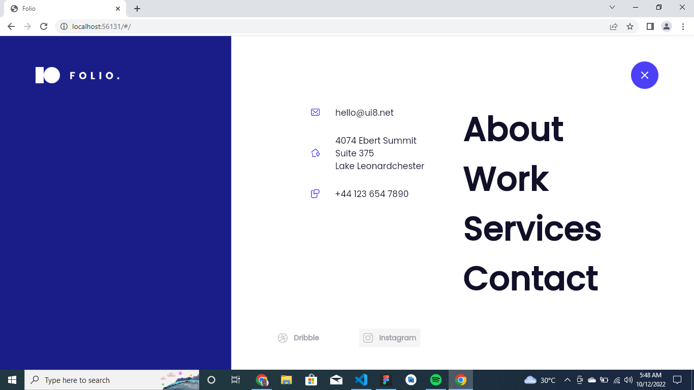

 
# Web Portifolio Template for Designers 👋


[](#)


A Responsive e Bootstrap portfolio template for Designers, Developers, Agency and all the creatives.  built with Flutter Made with 💙

# Flutter Version
Flutter 3.0.2


# 💻 Requirements

- Any Operating System (ie. MacOS X, Linux, Windows)
- Any IDE with Flutter SDK installed (ie. IntelliJ, Android Studio, VSCode etc)
- A little knowledge of Dart and Flutter

 # Screenshots 

 | 1 | 2|
|------|-------|
|||


 | 3 | 4|
|------|-------|
|||


 | 5 | 6|
|------|-------|
|||


 | 7 | 8|
|------|-------|
|||

 | 9 | 10|
|------|-------|
|||


 | 11 | 12|
|------|-------|
|||

 | 13 | 14|
|------|-------|
|||

 | 15 | 16|
|------|-------|
|||

 | 17 | 18|
|------|-------|
||| -->

# Command
### Install dependencies

```sh
flutter pub get
```

### Run application

```sh
flutter emulators --launch <emulator_name>
flutter run
```

### Build

```sh
flutter build web
```

# Plugins

- [flutter_svg](https://pub.dev/packages/flutter_svg) 
- [google_fonts](https://pub.dev/packages/google_fonts) 
- [url_launcher](https://pub.dev/packages/url_launcher) 
- [get](https://pub.dev/packages/get) 


<!-- # Features
- Light/Dark Theme
- Create Task 
- Delete Task
- Read Task
- Google Authentication
- Feedback
- Suggest Feature
- Multi-Language Localization (English, French, Portuguese)
- Local Notification
- Follow on Twitter
- Dismissible Slider 
- Local Notification -->


## Inspiration
 * Dribbble: [@UI8](https://dribbble.com/shots/14119816-Folio-Designer-Portfolio-Kit-Mobile-Version)


## Author

👤 **Dammy Richie**

* Github: [@Dammy Richie](https://github.com/ichie2)
 

## Contributors

👤 **Dammy Richie**


